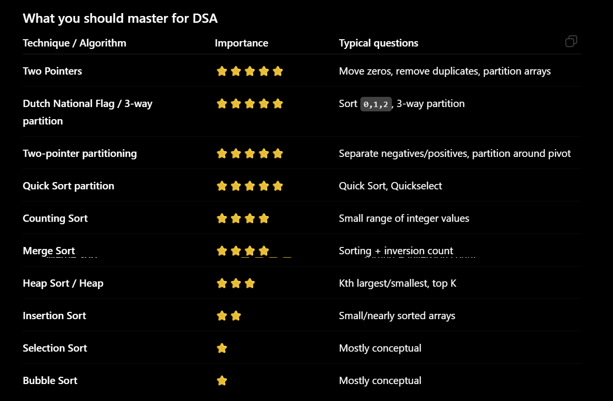

Learning Pattern

1. Two Pointers
       ↓
2. Dutch National Flag / 3-way partition
       ↓
3. Quick Sort partition
       ↓
4. Quickselect
       ↓
5. Merge Sort + Merge
       ↓
6. Counting Sort
       ↓
7. Heap / Heap Sort